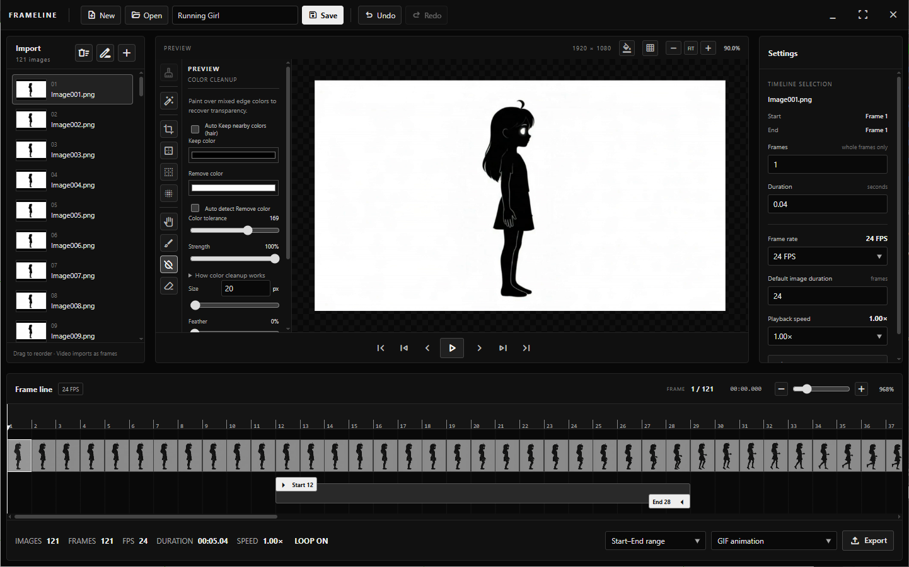

<p align="center">
  
</p>

# FrameLine

Animating an AI-generated character with image-to-video? FrameLine helps you turn that video into usable animation assets: extract PNG frames, remove backgrounds, clean up edges, and keep only the frames you need.

Built for 2D animators, it also works with hand-drawn artwork and other image sequences.

<p align="center">
  <a href="https://github.com/emanf/FrameLine/releases">
    
  </a>
</p>

## Getting started

### Option 1: Download a compiled version

Open the [Releases page](https://github.com/emanf/FrameLine/releases) and download the build for your operating system and CPU architecture. Follow the release's setup instructions, then launch FrameLine.

If a build for your platform is not listed, use the source-code option below.

### Option 2: Run from source

Choose **Code → Download ZIP** and extract it, or clone this repository. Install Node.js 20 or newer, npm, and Python 3.12 or newer, then open a terminal in the project folder and run:

```sh
python -m pip install -r requirements.txt
npm install
npm start
```

On Windows, you can also use `run.bat` to check dependencies and launch the app..

## Features and usage

- **Media import:** Import common image and video formats. Extract video frames at the project FPS, a time interval, or a fixed image count.
- **Blank images:** Create batches with preset or custom dimensions and transparent or solid backgrounds. Existing artwork can supply dimensions and a background color sampled from its corners.
- **Batch rename:** Rename all or selected images with numbered sequences or patterns such as `Run_{number}{ext}`. Set number padding, start, increment, order, and duplicate handling; source exports use the resulting names.
- **Frame-based timeline:** Reorder clips, resize durations in whole frames, and move or adjust multiple clips together. Right-click to delete frames before or after a clip while retaining the imported images.
- **Playback range:** Drag Start and End to define a loop. Set custom FPS and playback speed without changing clip durations.
- **Preview:** Keep zoom and pan across frames, move beyond image boundaries, and inspect transparency against a checkerboard or chosen color. An adjustable grid helps with alignment.
- **Crop, Outline, and Padding:** Enter exact crop coordinates, add inside/center/outside outlines, or add transparent padding with independent or linked sides. Supported edits can apply to one image or the whole batch.
- **Brush and Eraser:** Use adjustable size, opacity, feather, and round or square brush shapes. Disable anti-aliasing with zero feather for crisp pixel art.
- **Remove Background:** Detect background colors automatically or choose a custom color. Aggressive removal targets enclosed matches; chroma key and sampled-color modes offer more control. Adjust edge smoothing, blur, tint, spill suppression, and edge color cleanup.
- **Ignore Brush:** Paint protected areas in the removal window to preserve their colors and transparency. Protection marks also work across image batches.
- **Color Cleanup Brush:** Replace unwanted color mixtures and recover transparency with Keep/Remove colors or local automatic detection. Auto Keep nearby colors preserves hair, highlights, and shadows, with adjustable sampling distance and opacity recovery.
- **Refine Edges:** Repair white or colored fringes, clean transparency, smooth boundaries, and optionally shrink edges while preserving nearby foreground colors.
- **Clean Pixels:** Reduce noise and uneven colors across the whole image, including colorful artwork. Preview cleanup strength, color tolerance, radius, and isolated speckle removal, then apply to one image or all images. Transparency stays unchanged.
- **Live editing and originals:** Preview effects before applying, retain each imported original, and restore it with Clear. Undo treats each completed brush stroke or batch edit as one step; switching tools resolves pending changes.
- **Export:** Output GIF, MP4, MOV, WebM, AVI, MKV, source images, timeline PNG frames, or contact sheets. Choose the full timeline, Start–End range, or selected clips. GIF and video follow FPS and playback speed.
- **Tool extensions:** Add tools by copying an extension folder into the app. Built-in and third-party tools share a class-based SDK with managed previews, progress, and image history.
- **Portable projects:** Save originals, edited images, effect data, timeline, and settings in one `.frameline` bundle that opens without the source files. Legacy JSON projects remain supported.

## Keyboard and mouse shortcuts

| Shortcut | Action |
| --- | --- |
| Space | Play or pause |
| Left / Right | Step one frame |
| Shift + Left / Right | Previous or next clip |
| Home / End | First or last frame |
| Ctrl + A | Select all in the focused Import list, otherwise all clips |
| Ctrl + C / X / V | Copy, cut, or paste in the focused editing area |
| Ctrl + D | Duplicate the selection |
| Delete / Backspace | Delete the selection |
| Ctrl + Z | Undo |
| Ctrl + Y or Ctrl + Shift + Z | Redo |
| Ctrl + S | Save the project |
| Alt + mouse wheel | Resize Brush, Eraser, Color Cleanup Brush, or an active Ignore Brush |
| F11 | Toggle full screen |

Command can replace Ctrl for keyboard commands on macOS. Editing shortcuts are inactive while typing or using a dialog.

## Local data

FrameLine stores preferences and working assets in Electron's user-data directory, normally `%APPDATA%\frameline` on Windows. After an Electron installation change, startup moves Chromium caches into `cache-backup-*` folders and rebuilds them. Locked caches use a separate cache path and bypass disk shader caching while hardware rendering stays enabled. Browser storage, settings, and image/project assets remain in place.

## Development

The app uses Electron and Node.js for desktop integration, vanilla JavaScript ES modules for the renderer, Sharp for import conversion, and Python/Pillow for image processing. The renderer separates its project model, editing commands, and DOM views. Node/Electron APIs stay in the main process and preload bridge with context isolation enabled.

| Area | Entry point |
| --- | --- |
| Main process and IPC | `src/main.cjs` |
| Renderer API | `src/preload.cjs` |
| Python bridge | `src/main/python-bridge.cjs` |
| Startup and cache recovery | `src/main/startup.cjs` |
| Application composition and workflows | `src/renderer/application/` |
| Tool SDK and built-ins | `src/renderer/tools/` |
| Installed extensions | `extensions/` or user-data `extensions/` |
| Layout and theme | `src/renderer/index.html`, `src/renderer/styles.css` |
| Project and playback models | `src/renderer/model/` |
| Timeline editing and rendering | `src/renderer/viewmodel/`, `src/renderer/view/` |
| Processing and project archives | `backend/` |

Package standalone apps with `python scripts/build.py`. See [Building and platform support](docs/building.md) for setup, separate architecture folders, and the owner-only manual workflow that uploads packages to your latest release.

Developer guides: [Architecture](docs/architecture.md), [Plugin development](docs/plugin-development.md), [Tool API](docs/tool-api.md), and [Contributing](docs/contributing.md). A complete [Invert Colors extension](docs/examples/invert-colors) demonstrates the installation and processing contract.

Run the checks from the repository folder:

```sh
npm test
npm run test:backend
npm run test:ui
npm run test:main
```

These cover model/editing behavior, image and export processing, UI workflows, and production Electron/Python integration. For effect timings and output-pixel hashes, run `python scripts/benchmark-effects.py`.
