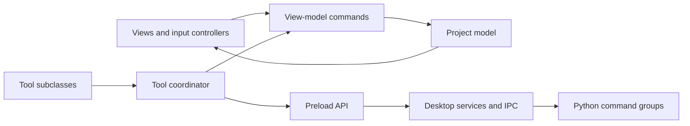

# FrameLine architecture

FrameLine separates project data, editing commands, presentation, desktop services, and image processing. The renderer uses ES modules and runs with context isolation enabled and Node integration disabled. Electron main-process modules use CommonJS. Python processors use Pillow.

## Application composition

`src/main.cjs` acquires the single-instance lock, prepares Chromium caches, and starts `DesktopApplication`. The application owns Python workers, discovers installed extensions, registers IPC by domain, and creates the window. `src/preload.cjs` exposes the narrow `window.frameLine` API.

`src/renderer/app.mjs` creates `EditorApplication`. Its constructor composes the controllers and views; `start()` initializes state and binds inputs in dependency order. `ToolCoordinator` registers built-ins before preferences are restored, then loads installed extensions independently.

## Renderer layers

| Layer | Responsibility | Location |
| --- | --- | --- |
| Model | Project defaults, validation, frame math, crop geometry, raster masks, image-effect data, caches | `src/renderer/model/` |
| View model | Editing state, history, selection, validated options, transient tool and viewport state | `src/renderer/viewmodel/` |
| Commands | Image-list, image-effect, timeline, selection, and project-setting operations | `src/renderer/viewmodel/commands/` |
| View | DOM/canvas rendering, timeline virtualization, themed controls and dialogs | `src/renderer/view/` |
| Application | Service composition, input routing, async operations, workflow coordination | `src/renderer/application/` |
| Tools | Inherited tool contract, validated registry, individual built-in tool adapters | `src/renderer/tools/` |

`TimelineViewModel` is the public editing facade. Its composed command classes mutate the same project and use the same history. Media services are injected into its constructor, allowing tests to supply an implementation without Electron or a DOM.

`EditorSessionViewModel` owns transient preview jobs, pan, tool selection, brush gestures, and busy flags. Those values never become project fields. Property accessors expose session state to the composed application components without duplicating it. DOM references stay in views and application components.

Application controllers call bound commands through the composition context. A controller should perform one workflow: imports, exports, playback, keyboard handling, crop input, or another focused operation. Model and view-model code must not query the DOM. `TimelineView` composes virtual image-list/track views, a bounded image cache, preview presentation, and property/status views under `view/components/`.

The background-removal modal creates a session shared by four components: settings validation, preview scheduling, navigation/display, and the protected-area brush. Its dialog coordinator owns attachment and cleanup of event handlers.

## Tool architecture

Every built-in tool is a class using the public tool inheritance tree. The registry validates IDs, metadata, API versions, and field schemas before mounting controls. Definitions are copied and frozen so a tool cannot change registered IDs or numeric bounds later.

`ToolCoordinator` owns selection guards, discovery, backend routing, custom pointer dispatch, and custom canvas commits. `ToolControlsView` builds processor controls from descriptors. `ToolOptionsViewModel` validates their values independently of the DOM. Existing crop, padding, outline, and paint controllers retain their specialized interaction and rendering implementations; their tool classes delegate through the same lifecycle contract.

Installed tools may provide a Python processor, override image processing in JavaScript, implement pointer hooks, or expose an immediate action. The [plugin guide](plugin-development.md) explains each path; the [API reference](tool-api.md) defines the contract.

## Editing and history

Timeline durations and positions are positive whole frames. Start/end positions are derived from sequence order and duration. Seconds appear only in UI conversion, playback timing, and media encoding.

Project edits record a snapshot before mutation, increment the edit revision, invalidate derived frame caches, and notify subscribed views. Selection and playhead navigation do not create persistent edits. History has a byte limit as well as a count limit.

Pending tool gestures have their own history tied to the project history-state ID. Releasing a brush stroke records one gesture. Apply promotes those strokes without collapsing their individual undo steps; batch processing commits all image results as one project edit.

An image retains its original path and dimensions while its working result changes. Processing materializes the current crop, outline, and strokes before the next effect, preventing edits from being lost or applied twice. Clear restores the original; Undo restores the prior working result.

## Async processing and progress

The Python bridge uses JSON-lines requests with correlated operation IDs. Committed work and previews use separate workers, so an obsolete preview does not block Apply. Preview requests are debounced, keep the newest pending settings, and validate their source/revision before showing results. Cancellation uses a cooperative cancellation file checked by processors.

A processed-image preview is temporary. It is decoded into a canvas and released after use. Apply processes the same options, checks the expected revision, and commits only if the source is still valid. Stale outputs are discarded through a main-process ownership map. User-visible progress runs throughout batch processing and export tasks.

Python commands are grouped under `backend/commands/`: background operations, image-output commands, raster rendering, GIF encoding, video operations, and image/contact-sheet exports. `backend/engine.py` owns the transport, progress/cancellation context, command dispatch, and a compatibility facade. Command groups resolve shared callbacks through that context, keeping caches and cancellation consistent.

## Persistence

`.frameline` files are portable ZIP bundles containing project JSON and required originals/working assets. Saving uses a temporary file and atomic replacement. Opening extracts assets into the app's user-data directory and validates the project before replacement. Legacy JSON projects remain readable.

Plugin results are ordinary working PNGs. Reopening a saved project does not require the plugin that produced them. Applied processing settings are baked into the image; FrameLine does not store a replayable plugin recipe. Tool preferences remain local to the application.

## Performance boundaries

Timeline/list views virtualize large collections. Brush rendering uses coalesced pointer samples and regional repainting. Working-image caches prevent repeated materialization, and Pillow processing caches have memory limits. Python processors should use native Pillow operations or tiled/vectorized processing instead of full-image Python pixel loops. Expensive work belongs in the processing service rather than DOM event handlers.

The refactor keeps those mechanisms and output behavior intact. It is a structural change; choosing a new folder or class does not itself make an algorithm faster.
